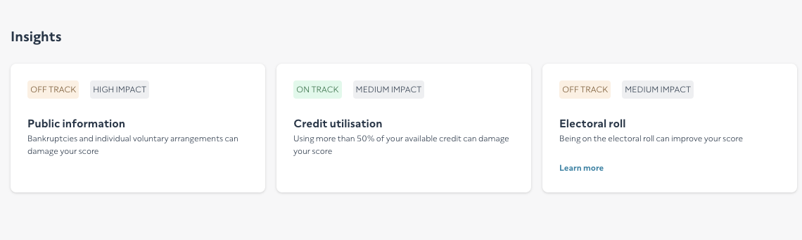
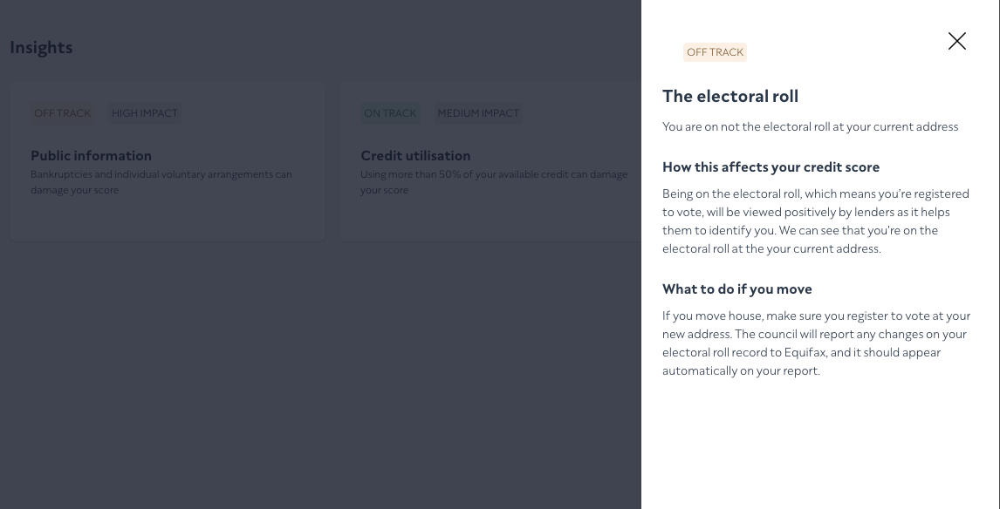

# Nate's Note:

This code was create with 4 hours on a clock.

#### TODO:

Unit tests, ENV files.

[Main Report Screen]


[Right Drawer]


My steps:

Create a new react project with typescript template

> npx create-react-app nate-cs-test --template typescript

Go to nate-cs-test

> cd nate-cs-test

Build project

> yarn

---

Install Tailwind CSS

> npm install -D tailwindcss

Initial tailwindcss with tailwind.config.js on the root folder.

> npx tailwindcss init

---

Add Path Alias

> yarn add @craco/craco

---

Add CS(ClearScore) tailwind configs

Border radii

```
8px
4px
```

Colours

```
"Midnight": #253648
"Gallery": #F7F7F8
CTA: #0F81A3
CTA (hover): #66AEC5
Green pill text: #15693B
Green pill background: #DDF9EA
Orange pill text: #764C25
Orange pill background #FDEFE2
Gray pill background #EEEFF1
```

Font sizes

```
20px
16px
14px
12px
```

Font weights

```
normal
bold
```

Spacing

```
24px
16px
10px
8px
4px
```

Shadows

```
0 0.5rem 0.75rem rgba(0,0,0,0.16);
```

Breakpoints

```
Small: min-width 375px
Medium: min-width 768px
Large: min-width 1024px
Extra Large: min-width 1280px
```

---

# Business Logic

### `Public Information:` (OFF TRACK)

```
personal => publicInfo => courtAndInsolvencies.length > 0
```

### `Credit Utilisation:`(OFF TRACK)

```
accounts => overview => balance.amount > limit.amount /2
```

### `Electoral Roll:`(OFF TRACK)

```
personal => electoralRoll.length > 0
```

---

# Getting Started with Create React App

This project was bootstrapped with [Create React App](https://github.com/facebook/create-react-app).

## Available Scripts

In the project directory, you can run:

### `npm start`

### `npm test`

### `npm run build`

### `npm run eject`
